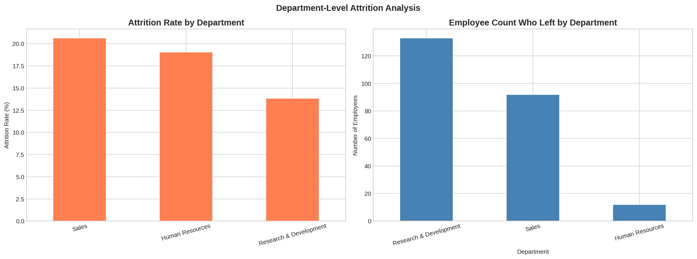
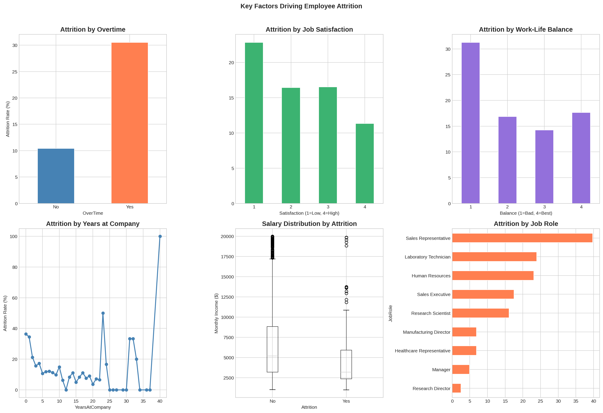
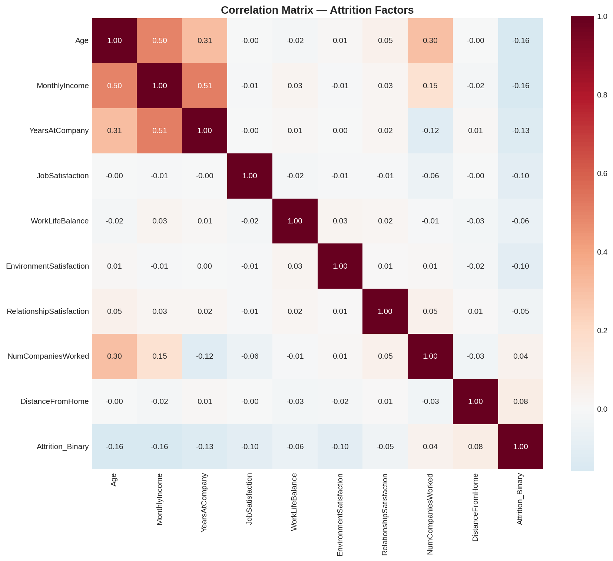
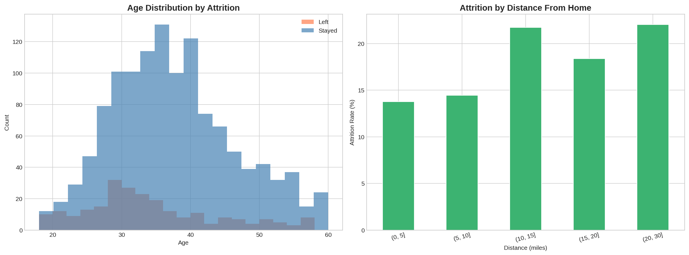
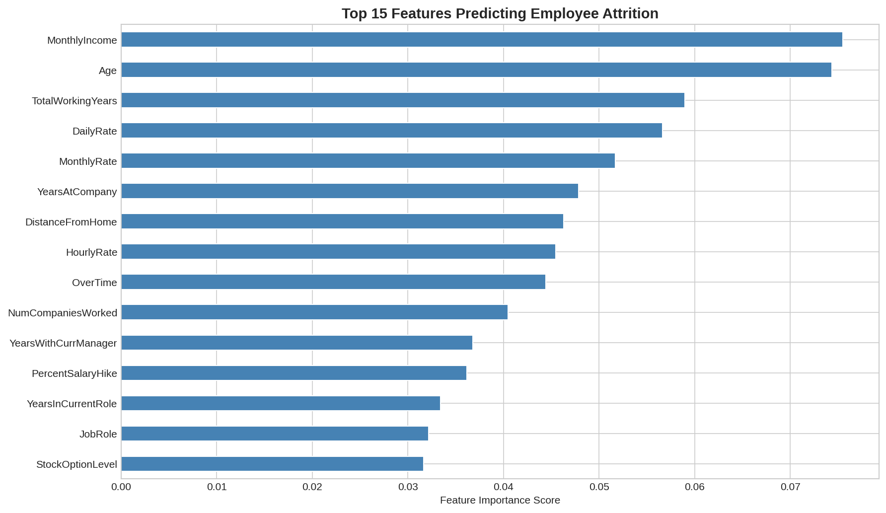

# HR Employee Attrition Analysis
## Python · Tableau · Power BI | IBM HR Analytics Dataset

# Project Overview
A comprehensive end-to-end analysis of employee attrition
using IBM's HR Analytics dataset of 1,470 employees.
The project identifies key drivers of attrition, quantifies
the business cost of employee turnover, and builds a
Random Forest machine learning model to predict which
employees are most at risk of leaving, enabling proactive
HR intervention before resignation occurs.

---

## 📊 Interactive Dashboards

### Tableau Dashboard
👉 **[View Tableau Dashboard](https://public.tableau.com/app/profile/varshini.karuppusamy/viz/HREmployeeAttritionAnalysisDashboard_17846685692530/Dashboard1?publish=yes)**

---

## Dataset
| Detail | Value |
|--------|-------|
| Source | IBM HR Analytics (Kaggle) |
| Records | 1,470 employees |
| Features | 35 variables |
| Target | Attrition (Yes/No) |
| Attrition Rate | ~16.1% |

**Download:**
kaggle.com/datasets/pavansubhasht/ibm-hr-analytics-attrition-dataset

---

## Business Questions Answered
- What is the overall attrition rate and cost?
- Which departments and job roles have highest attrition?
- Does overtime significantly increase attrition risk?
- How does salary affect likelihood of leaving?
- Which employees are most at risk (ML prediction)?
- What recommendations can reduce attrition by 10%?

---

## Tools & Technologies
| Category | Tools |
|----------|-------|
| Language | Python 3.10 |
| Data Analysis | Pandas, NumPy |
| Visualization | Matplotlib, Seaborn |
| Machine Learning | Scikit-learn |
| Models | Logistic Regression, Random Forest |
| BI Tools | Tableau Public, Power BI Desktop |
| DAX | 5 custom measures |

---

## Analysis Sections

### Day 1 - Setup & Exploration
- Loaded 1,470 employee records
- Explored 35 features
- Identified overall attrition rate of ~16.1%

### Day 2 - Attrition Overview & Cost Analysis
- Department-level attrition breakdown
- Business cost calculation:
  Conservative estimate: ~$4.2M annually
  Aggressive estimate: ~$16.8M annually

### Day 3 - Factor Analysis
- Overtime vs attrition
- Job satisfaction vs attrition
- Work-life balance vs attrition
- Years at company trend
- Salary distribution by attrition
- Job role breakdown

### Day 4 - Deep Dive Analysis
- Correlation heatmap of all features
- Age distribution by attrition
- Distance from home impact

### Day 5 - Machine Learning Model
- Label encoding of categorical variables
- Train/test split (80/20, stratified)
- Logistic Regression baseline
- Random Forest classifier
- Feature importance ranking
- Employee risk segmentation (Low/Medium/High)

---

## Key Findings

1. **Overall attrition rate is 16.1%** - costing an
   estimated $4-17M annually depending on
   replacement cost assumptions

2. **Overtime is the strongest behavioral predictor**
   - employees working overtime are 3x more likely
   to leave than those who don't

3. **Sales Representatives have the highest attrition**
   at ~40% — nearly 1 in 2 Sales Reps leave annually

4. **Employees who left earned ~$2,000 less per month**
   than those who stayed - salary is a key retention lever

5. **Attrition peaks in the first 2 years** - new
   employees are at highest risk, pointing to
   onboarding and culture fit issues

6. **Random Forest model identified high-risk employees**
   enabling proactive HR intervention before resignation

---

## Business Recommendations

| # | Recommendation | Target Group | Expected Impact |
|---|---------------|--------------|-----------------|
| 1 | Eliminate or compensate overtime fairly | All departments | Reduce attrition 15-20% |
| 2 | Salary review for bottom 25% earners | Sales, HR | Reduce financial attrition |
| 3 | 90-day onboarding program | New hires | Reduce Year 1 attrition |
| 4 | Deploy ML risk model monthly | HR team | Proactive intervention |
| 5 | Job satisfaction surveys quarterly | All employees | Early warning system |

---

## Machine Learning Results

| Model | ROC-AUC |
|-------|---------|
| Logistic Regression | ~0.72 |
| Random Forest | ~0.78 |

**Top 5 Predictors of Attrition:**
1. Monthly Income
2. OverTime
3. Age
4. Years at Company
5. Job Satisfaction

---

## Visualizations

### fig01 - Department Attrition

### fig02 - Key Attrition Factors

### fig03 - Correlation Heatmap

### fig04 - Age & Distance Analysis

### fig05 - Feature Importance

## Skills Demonstrated
`Python` `Pandas` `NumPy` `Matplotlib` `Seaborn`
`Scikit-learn` `Random Forest` `Logistic Regression`
`Feature Importance` `ROC-AUC` `Risk Segmentation`
`Tableau` `Power BI` `DAX` `HR Analytics`
`Churn Prediction` `Business Cost Analysis`
`Data Storytelling` `Machine Learning`

---

## Author
**Varshini Karuppusamy**
MS Engineering Management - Northeastern University '26
karuppusamy.v@northeastern.edu

---

## Related Projects
- 🏥 [Healthcare Patient Analytics](link)
- 🏠 [US Housing Market Analysis](link)
- 📊 [BLS US Employment Analysis](link)
- 🚗 [NYC Motor Vehicle Collision Analysis](link)
- 🌍 [COVID-19 Global Trends Analysis](link)
- 🛒 [E-Commerce Sales Performance Analysis](link)
